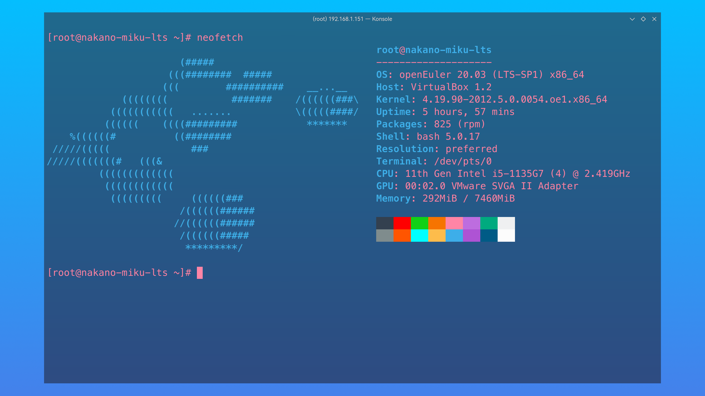
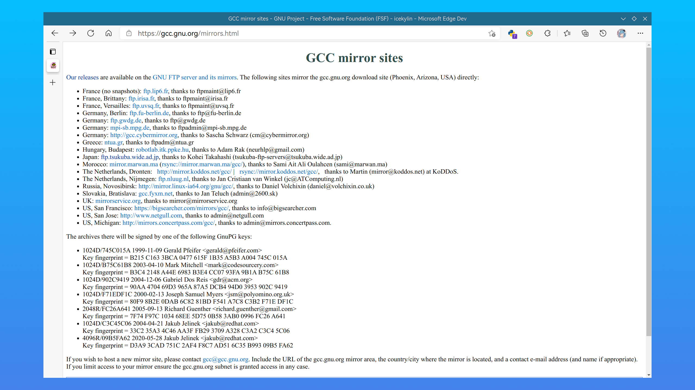
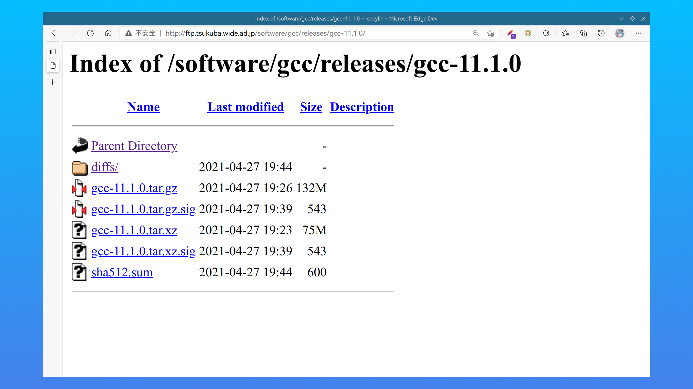
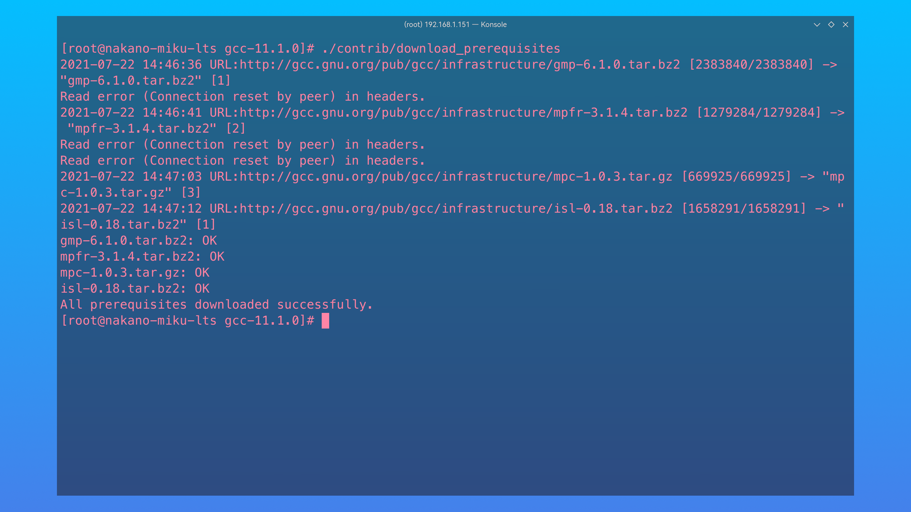
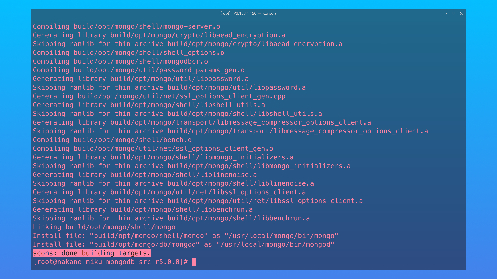
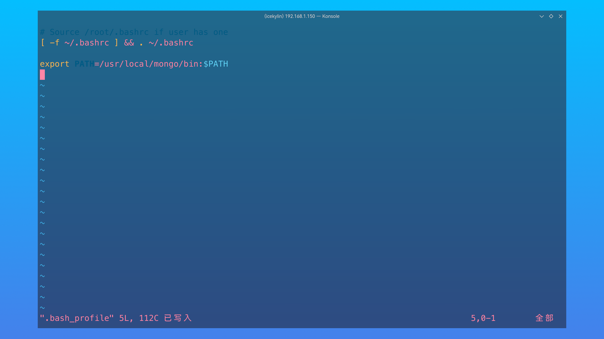
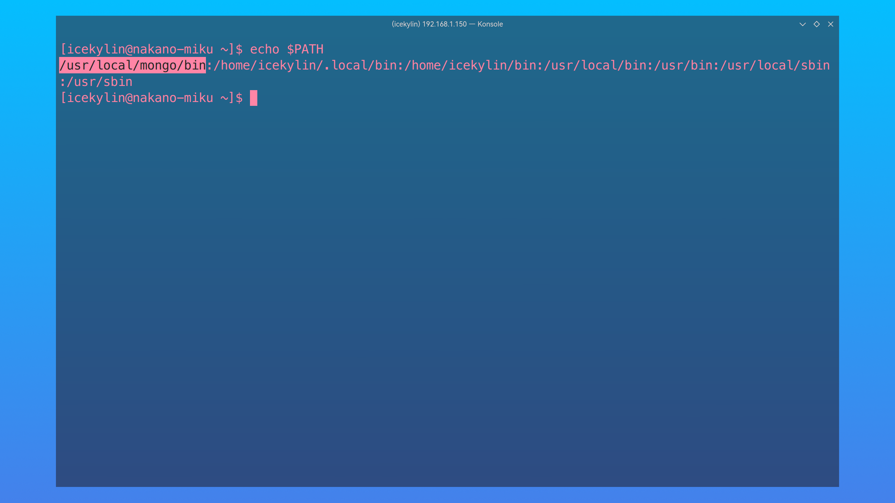
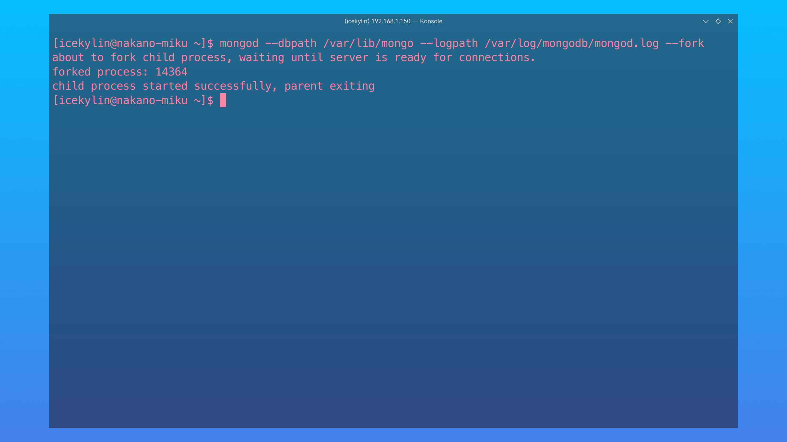
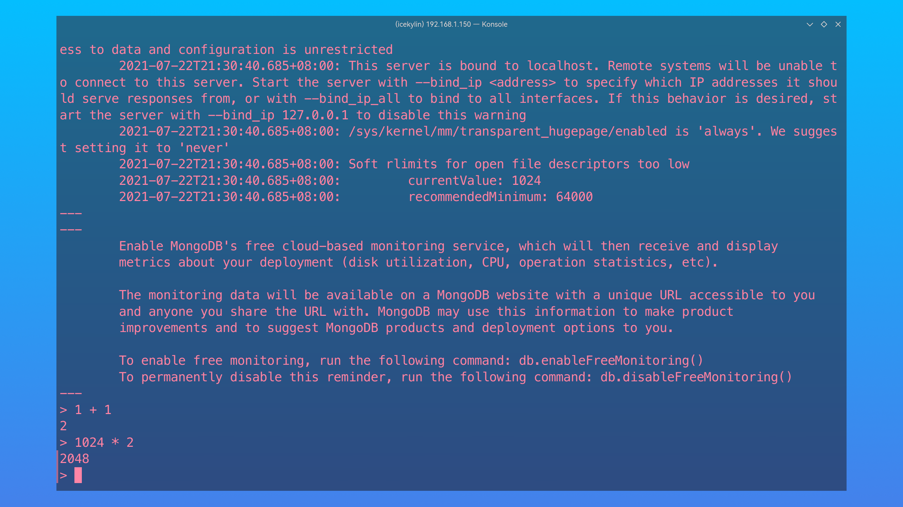
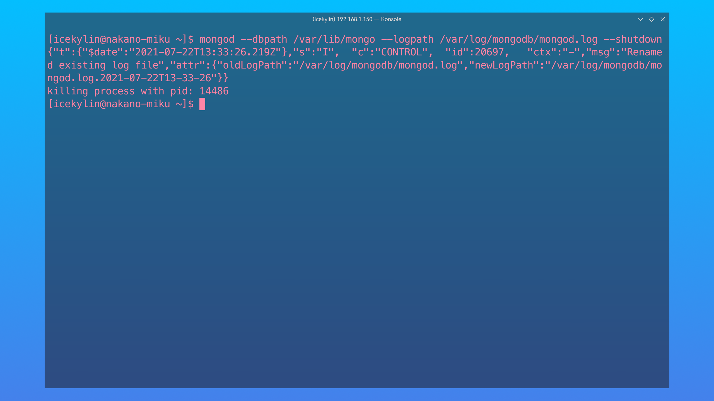

# MongoDB 数据库

> ### 🍃 不知细叶谁裁出，二月春风似剪刀
>
> 这一小节我们将讨论如何在 openEuler 上部署 MongoDB 数据库。

> ### 🔖 这一节将会讨论：
>
> ::: details 目录
>
> [[toc]]
>
> :::



## 了解 MongoDB 数据库

[MongoDB](https://www.mongodb.com/zh-cn) 是由 MongoDB Inc.（当时是 10gen 团队）于 2007 年 10 月开发，2009 年 2 月首度推出的非关系型数据库，是通用、基于文档的分布式数据库。

## 安装 MongoDB 数据库

### 1. 下载安装文件

1. 打开 [MongoDB 下载页面](https://www.mongodb.com/try/download/community) > `Version`（版本）选择 `5.0.0` > `Platform`（平台）选择 `Source (tgz)`（源码）> 点击 `Download`（下载）或 `Copy Link`（复制下载链接）后通过 `wget` 下载：

   

2. 解压源码压缩包 `mongodb-src-r5.0.0.tar.gz`：

   ```sh
   tar -xf mongodb-src-r5.0.0.tar.gz -C /usr/local/
   ```

### 2. 安装编译所需依赖

由于 MongoDB 官方没有提供 openEuler 的二进制压缩包，所以需要自行编译。

按照官方文档的要求和系统的，编译 MongoDB 需要以下依赖：

- GCC 8.2 或更新
- libcurl-devel
- Python 3.7.x 和 Pip 模块
- openssl-devel

1. 检查依赖版本：

   ```sh
   gcc --version # 需要更新（openEuler 20.03 (LTS-SP1) 需要，更新 openEuler 版本不需要）
   python3 --version # 符合要求
   pip3 --version # 符合要求
   ```

   

2. 安装相关依赖：

   ```sh
   sudo dnf install libcurl-devel scons
   ```

   

3. 打开 [GCC 镜像列表](https://gcc.gnu.org/mirrors.html) > 选择一个镜像站：

   

4. 以霓虹这个镜像站为例，点击 `release` > `gcc-11.1.0` > 点击 `gcc-11.1.0.tar.gz` 下载 GCC 源码：

   

   

5. 解压源码压缩包 `gcc-11.1.0.tar.gz` 到 `/usr/local/` 目录：

   ::: tip ℹ️ 提示

   以下命令请在 root 用户下执行：

   ```sh
   su - root
   ```

   :::

   ```sh
   tar -xf gcc-11.1.0.tar.gz -C /usr/local/
   cd /usr/local/gcc-11.1.0 # 切换到解压目录
   ```

6. 执行以下指令以下载安装 GCC 所需要的依赖包（如 gmp、mpfr、mpc 等）：

   ```sh
   ./contrib/download_prerequisites
   ```

   ::: tip ℹ️ 提示

   执行此命令需要确保系统安装了相关依赖，否则使用以下命令安装：

   ```sh
   dnf install bzip2 wget
   ```

   :::

   

7. 手动创建一个目录，用于存放编译 GCC 源码包生成的文件：

   ```sh
   mkdir /usr/local/gcc-build-11.1.0
   cd /usr/local/gcc-build-11.1.0
   ```

8. 由于 GCC 编译器支持多种编程语言的编译，而实际情况中我们可能只需要编译 C 和 C++ 两种编程语言，故需要进行配置：

   ```sh
   ../gcc-11.1.0/configure --enable-checking=release --enable-languages=c,c++ --disable-multilib
   ```

   

   同时会生成 `Makefile` 和相关文件：

   

9. 使用 `make` 命令编译 GCC：

   ```sh
   make
   ```

   ::: tip ℹ️ 提示

   此过程将非常耗时（2 小时或更长）。若使用 SSH 远程连接请务必配置并使用不间断会话服务，具体操作请参阅 [3. 不间断会话服务配置](../rookie/basic-cfg.md#_3-不间断会话服务配置)。

   :::

   

10. 执行以下命令安装 GCC：

    ```sh
    make install
    ```

11. 重启计算机，查看 GCC 版本信息：

    ```sh
    reboot
    gcc --version
    ```

    

12. 安装 Python 相关模块：

    ```sh
    cd /usr/local/mongodb-src-r5.0.0
    python3 -m pip install -r etc/pip/compile-requirements.txt
    ```

    

### 3. 编译 MongoDB

执行以下命令：

```sh
cd /usr/local/mongodb-src-r5.0.0
python3 buildscripts/scons.py DESTDIR=/usr/local/mongo install-core --disable-warnings-as-errors
```

::: tip ℹ️ 提示

此过程将非常耗时（2 小时或更长）。若使用 SSH 远程连接请务必配置并使用不间断会话服务，具体操作请参阅 [3. 不间断会话服务配置](../rookie/basic-cfg.md#_3-不间断会话服务配置)。

:::

当输出 `scons: done building targets.` 说明编译成功：



### 4. 配置 MongoDB

编译并安装 MongoDB 后，还需要做一些环境变量以及目录权限相关的配置。

::: tip ℹ️ 提示

以下命令请在需要管理 MongoDB 的用户下执行。

可以事先创建管理 MongoDB 的用户。

:::

#### 4-1. 设置环境变量

1. MongoDB 的可执行文件位于 `/usr/local/mongo/bin` 目录下，可将其添加到 `PATH` 路径中：

   ```sh
   vim ~/.bash_profile
   ```

   ```sh
   export PATH=/usr/local/mongodb/bin:$PATH
   ```

   

2. 重新登录，验证效果：

   ```sh
   echo $PATH
   ```

   

#### 4-2. 配置目录

默认情况下 MongoDB 启动后会初始化以下两个目录：

- `/var/lib/mongodb` —— 数据存储目录
- `/var/log/mongodb` —— 日志文件目录

在启动前可以先创建这两个目录并设置当前用户有读写权限：

```sh
sudo mkdir -p /var/lib/mongo
sudo mkdir -p /var/log/mongodb
sudo chown `whoami` /var/lib/mongo # 设置权限
sudo chown `whoami` /var/log/mongodb # 设置权限
```


## 启停 MongoDB 数据库

1. 使用以下命令启动 MongoDB：

   ```sh
   mongod --dbpath /var/lib/mongo --logpath /var/log/mongodb/mongod.log --fork
   ```

   

2. 使用以下命令进入 MongoDB 后台管理 Shell：

   ```sh
   mongo
   ```

   

   MongoDB Shell 是 MongoDB 自带的交互式 JavaScript Shell，用来对 MongoDB 进行操作和管理的交互式环境。可执行一些简单的算数运算：

   

3. 使用以下命令关闭 MongoDB：

   ```sh
   mongod --dbpath /var/lib/mongo --logpath /var/log/mongodb/mongod.log --shutdown
   ```

   

## 接下来...

🍻 恭喜！你已经成功在 openEuler 上部署了 MongoDB。如果您是初学者，可以由此开始学习操作 MongoDB；如果您已经对 MongoDB 非常熟悉了，相信您很快就可以完成其它的配置以及项目的部署。
