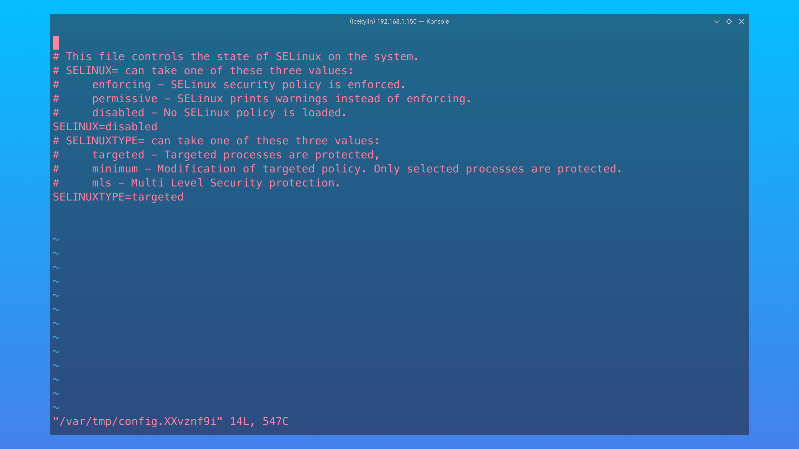
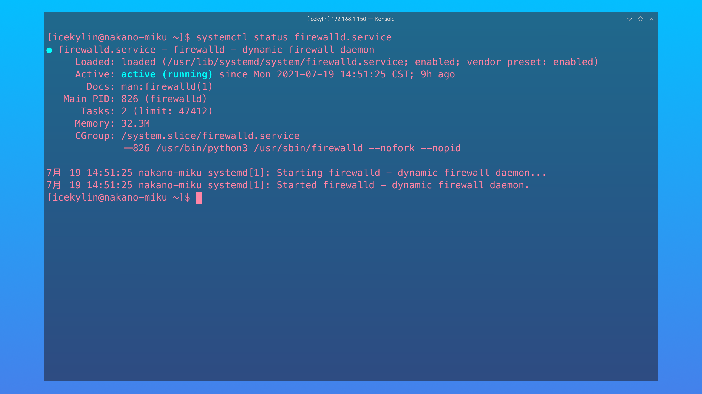
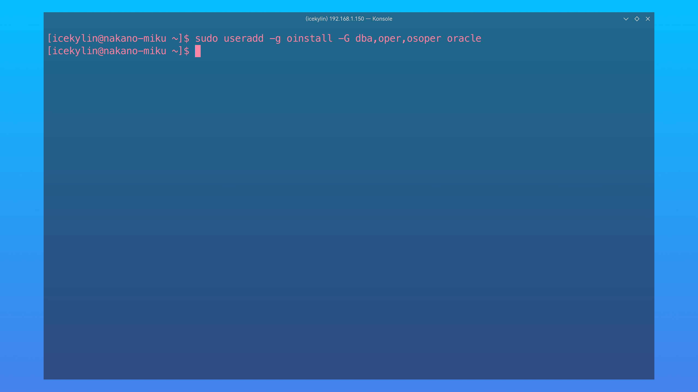
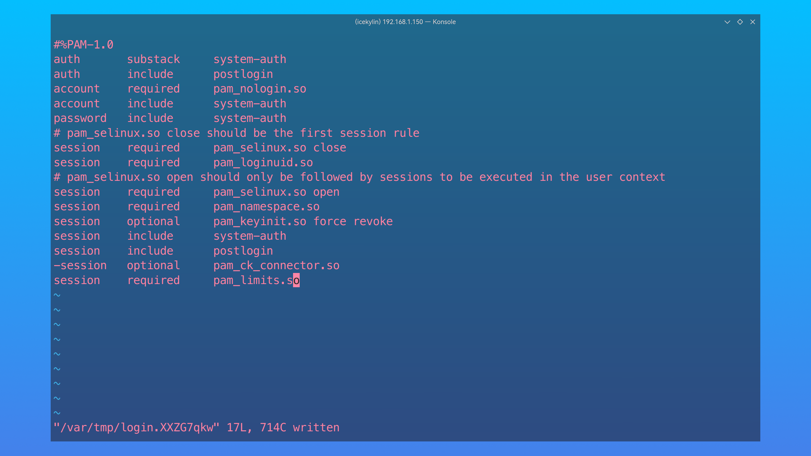
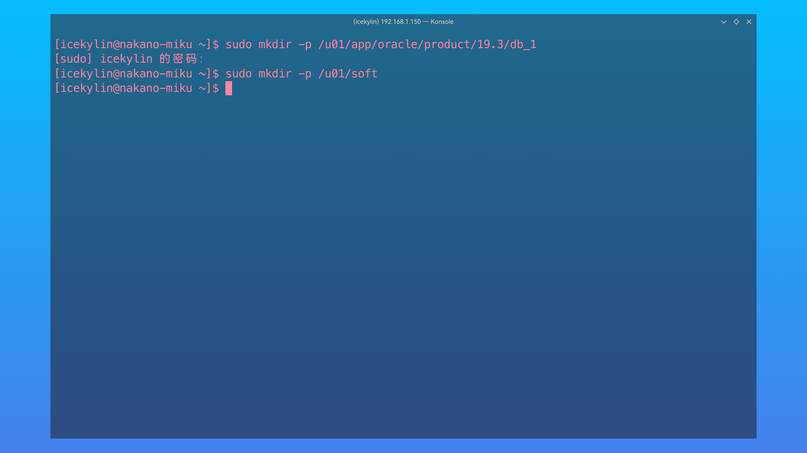
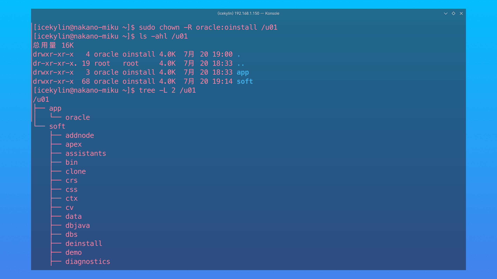
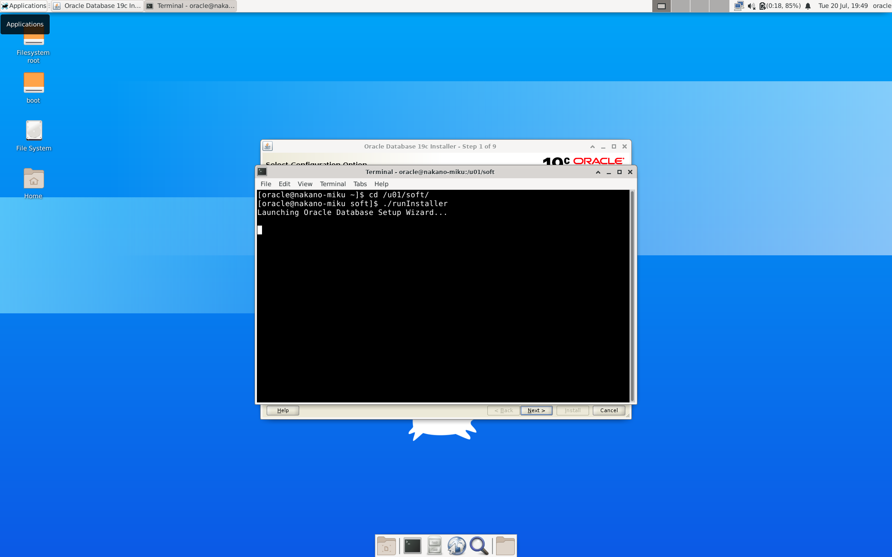
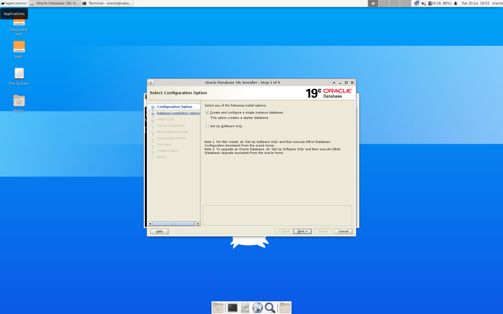
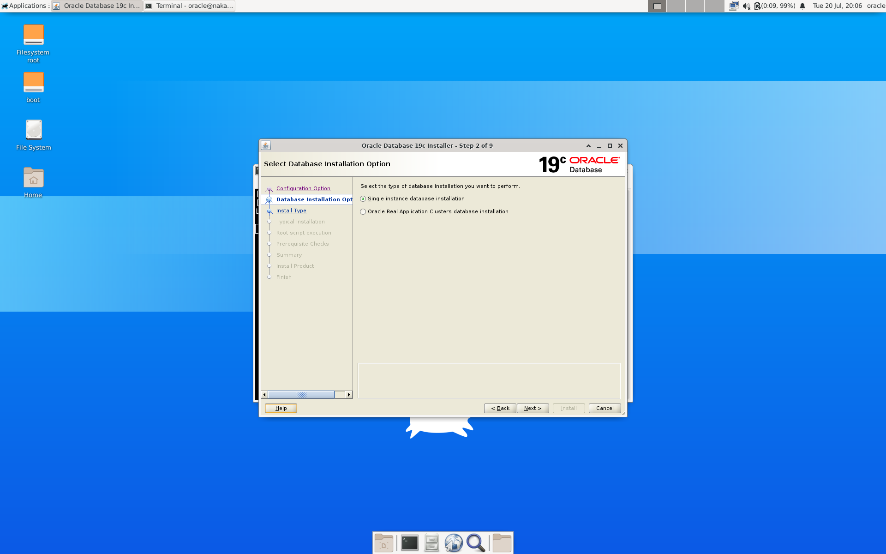

# Oracle 数据库

> ### 🏺 折戟沉沙铁未销，自将磨洗认前朝
>
> 这一小节我们将讨论如何在 openEuler 上部署 Oracle 数据库。

> ### 🔖 这一节将会讨论：
>
> ::: details 目录
>
> [[toc]]
>
> :::

## 了解 Oracle 数据库

[Oracle 数据库](https://www.oracle.com/cn/database/)（简称 Oracle）是 [甲骨文公司](https://www.oracle.com/cn/index.html) 的一款关系数据库。

当前最新的长期支持版为 Oracle Database 19c，但部分企业还在使用 [Oracle Database 12c](https://www.oracle.com/cn/database/12c-database/)。本指南会对这两个版本进行部署演示。

## 安装 Oracle 数据库

### 1. 固定 IP 地址

参阅 [1-2. 固定 IP 地址](../rookie/basic-cfg.md#_1-2-固定-ip-地址) 将 IP 地址固定。

### 2. 绑定主机名

参阅 [1-3. 绑定主机名](../rookie/basic-cfg.md#_1-3-绑定主机名) 将 IP 地址和主机名绑定。

### 3. 关闭 SELinux

1. 查看 SELinux 运行状态：

   ```sh
   sestatus
   ```

   若第一行为以下内容则为运行状态：

   ```sh
   SELinux status:                 enabled
   ```

2. 关闭 SELinux：

   ```sh
   setenforce 0 # 暂时关闭 SELinux
   sudoedit /etc/selinux/config # 编辑 SELinux 配置文件
   ```

   将 `SELINUX` 的值改为 `disabled`：

   ```conf
   SELINUX=disabled # 重启后才会生效
   ```

   

### 4. 关闭防火墙

1. 查看防火墙运行状态：

   ```sh
   systemctl status firewalld.service
   ```

   

2. 关闭防火墙：

   ```sh
   sudo systemctl stop firewalld.service # 关闭防火墙
   sudo systemctl disable firewalld.service # 禁止开机启动
   systemctl status firewalld.service # 复查一下
   ```

   

### 5. 重启系统

```sh
reboot
```

### 6. 下载安装文件

1. 打开 [Oracle 官方网站](https://www.oracle.com/cn/database/technologies/) > 点击 `下载 Oracle Database 19c`：

   

2. 点击 `Linux x86-64` 右侧的 `ZIP` 下载连接，开始下载：

   

   ::: tip ℹ️ 提示

   需要登录甲骨文账户并同意相关协议。

   :::

3. 若不是在 openEuler 系统中直接通过浏览器下载，则需要通过适当方法（如 FTP）将文件上传到 openEuler 系统中

### 7. 安装依赖包

1. 安装相关依赖包：

   1. 查询未安装的依赖包：

   ```sh
   rpm --query --queryformat "%{NAME}-%{VERSION}.%{RELEASE} (%{ARCH})\n" bc binutils compat-libcap1 compat-libstdc++-33 gcc gcc-c++ glibc glibc-devel ksh libaio libaio-devel libgcc libstdc++ libstdc++-devel make sysstat elfutils-libelf elfutils-libelf-devel fontconfig-devel libxcb smartmontools libX11 libXau libXtst libXrender libXrender-devel libnsl
   ```

   2. 安装未安装的依赖包：

   ```sh
   sudo dnf install bc binutils compat-libcap1 compat-libstdc++-33 gcc gcc-c++ glibc glibc-devel ksh libaio libaio-devel libgcc libstdc++ libstdc++-devel make sysstat elfutils-libelf elfutils-libelf-devel fontconfig-devel libxcb smartmontools libX11 libXau libXtst libXrender libXrender-devel libnsl # 已经安装的会自动跳过
   ```

### 8. 创建相关用户和用户组

1. 创建相关用户组：

   ```sh
   sudo groupadd oinstall
   sudo groupadd dba
   sudo groupadd oper
   sudo groupadd osoper
   ```

   

2. 创建相关用户并将其添加到相关组中：

   ```sh
   sudo useradd -g oinstall -G dba,oper,osoper oracle
   ```

   

3. 为 `oracle` 用户创建密码：

   ```sh
   sudo passwd oracle
   ```

   

### 9. 修改相关配置文件

1. 修改 `/etc/security/limits.conf` 文件来修改 `oracle` 用户的 Shell 限制：

   ```sh
   sudoedit /etc/security/limits.conf
   ```

   在文件末尾添加以下内容：

   ```conf
   oracle soft nproc 2047
   oracle hard nproc 16384
   oracle soft nofile 1024
   oracle hard nofile 65536
   oracle soft stark 10240
   ```

   

2. 修改 `/etc/sysctl.conf` 文件来修改数据库所需的内核参数：

   ```sh
   sudoedit /etc/sysctl.conf
   ```

   在文件末尾添加以下内容：

   ```conf
   fs.aio-max-nr = 1048576
   fs.file-max = 6815744
   kernel.shmall = 16451328
   kernel.shmmax = 33692319744
   kernel.shmmni = 4096
   kernel.sem = 250 32000 100 128
   net.ipv4.ip_local_port_range = 9000 65500
   net.core.rmem_default = 262144
   net.core.rmem_max = 4194304
   net.core.wmem_default = 262144
   net.core.wmem_max = 1048576
   ```

   

3. 使内核参数生效：

   ```sh
   sudo sysctl -p
   ```

   

4. 修改 `/etc/pam.d/login` 以添加验证模块：

   ```sh
   sudoedit /etc/pam.d/login
   ```

   在文件末尾添加以下内容：

   ```conf
   session    required     pam_limits.so
   ```

   

5. 修改 `/etc/profile` 以修改系统环境变量：

   ```sh
   sudoedit /etc/profile
   ```

   在文件末尾添加以下内容：

   ```sh
   if [ $USER = 'oracle' ]; then
      if [ $SHELL = '/bin/ksh' ]; then
         ulimit -p 16384
         ulimit -n 65536
      else
         ulimit -u 16384 -n 65536
      fi
   fi
   ```

   

6. 修改 `/home/oracle/.bash_profile` 以修改 `oracle` 用户环境变量：

   ```sh
   sudoedit /home/oracle/.bash_profile
   chown
   ```

   在文件末尾添加以下内容：

   ```sh
   export ORACLE_BASE=/u01/app/oracle
   export ORACLE_HOME=$ORACLE_BASE/product/19.3/db_1
   export ORACLE_SID=orcl
   export PATH=$PATH:$ORACLE_HOME/bin
   ```

   

### 9. 创建目录

1. 创建相关目录：

   ```sh
   sudo mkdir -p /u01/app/oracle/product/19.3/db_1
   sudo mkdir -p /u01/soft
   ```

   

2. 移动安装文件到对应位置并解压：

   ```sh
   sudo mv /path/to/LINUX.X64_193000_db_home.zip /u01/soft
   cd /u01/soft
   sudo unzip LINUX.X64_193000_db_home.zip > /dev/null
   ```

3. 修改属主和属组：

   ```sh
   sudo chown -R oracle:oinstall /u01
   ```

   

### 10. 开始安装

1. 在图形界面登录到 `oracle` 用户

2. 打开终端 > 切换到 `/u01/soft` 目录 > 运行安装向导：

   ```sh
   cd /u01/soft
   ./runInstaller # 运行安装向导
   ```

   /etc/locale.conf

   

   

3. 选择 `Set Up Software Only`（仅设置软件）> 点击 `Next`（下一步）：

   

4. 此处以单实例数据库为例，故选择 `Single instance database installation`（单实例数据库安装）> 点击 `Next`（下一步）：

   

5. 选择 `Enterprise Edition`（企业版）> 点击 `Next`（下一步）：

   

6. 由于之前已经配置了 `$ORACLE_BASE` 环境变量，所以点击 `Next`（下一步）即可：

   

7. 此处为产品清单目录（安装过程中产生的临时文件位置）以及对产品清单目录具有写权限的用户组，点击 `Next`（下一步）即可：

   

8. 此处为对数据库进行相应操作所需权限对应的用户组，同样的，点击 `Next`（下一步）即可：

   

9. 点击 `Next`（下一步）即可：

   

10. 安装：

```sh
dnf install mksh libaio libgfortran gcc-c++ rdma-core-devel libtiff libstdc++ libpng libpcap libjpeg-turbo libXrender libXi libXext libXau libX11 libstdc++ libXtst libgcc libcap libcap-ng libstdc++ libaio
```

## 接下来...
