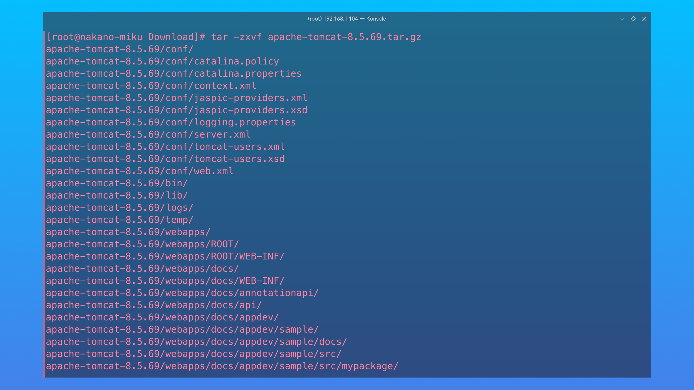
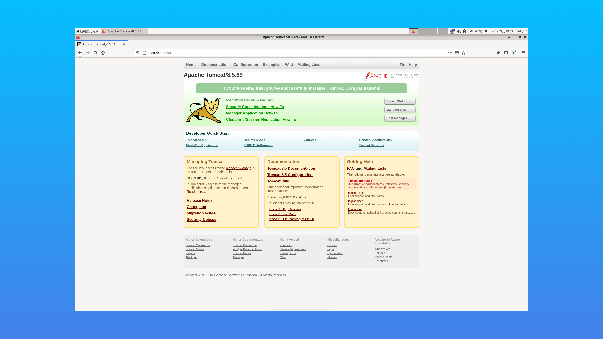
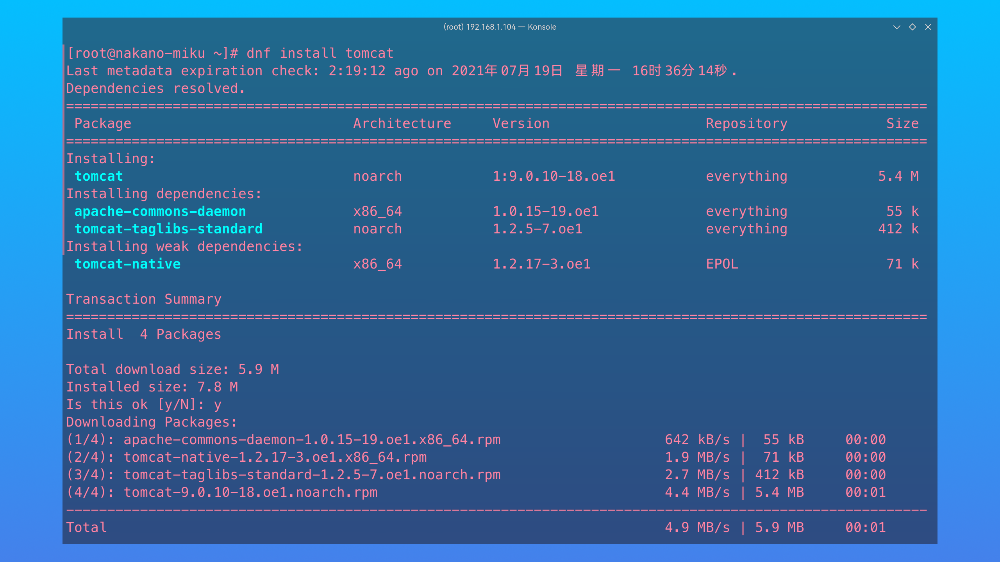
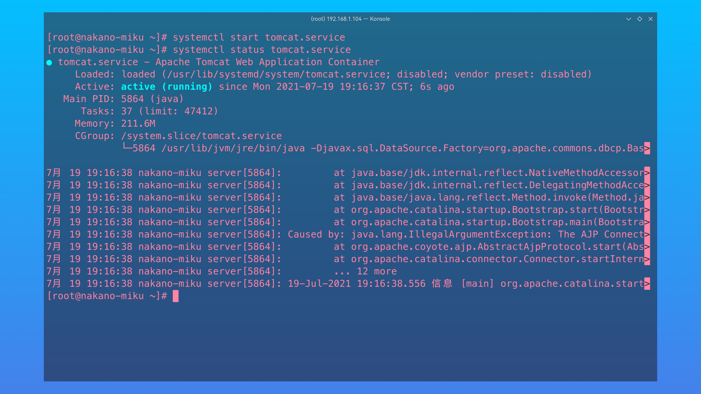
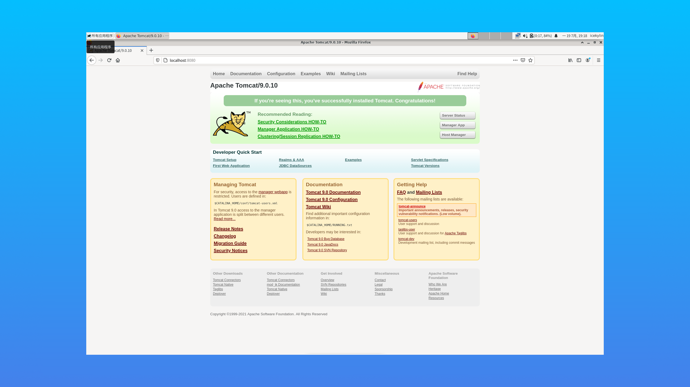

# Apache Tomcat

> ### 🐈 似虎能缘木，如驹不伏辕
>
> 这一小节我们将讨论什么是 Apache Tomcat 以及如何在 openEuler 上部署它。

> ### 🔖 这一节将会讨论：
>
> ::: details 目录
>
> [[toc]]
>
> :::

## 什么是 Apache Tomcat？

官方的定义如下 —— [Apache Tomcat](https://tomcat.apache.org/) 是 [Jakarta Servlet](https://projects.eclipse.org/projects/ee4j.servlet)、[Jakarta Server Pages（JSP）](https://projects.eclipse.org/projects/ee4j.jsp)、[Jakarta Expression Language](https://projects.eclipse.org/projects/ee4j.el)、[Jakarta WebSocket](https://projects.eclipse.org/projects/ee4j.websocket)、[Jakarta Annotations](https://projects.eclipse.org/projects/ee4j.ca) 和 [Jakarta Authentication](https://projects.eclipse.org/projects/ee4j.authentication) 规范的开源实现。这些规范是 [Jakarta EE](https://projects.eclipse.org/projects/ee4j.jakartaee-platform) 平台的一部分。

简单来说，可以将 Apache Tomcat 视为 Java Web 应用服务器软件。常见的其它 Java 应用服务器软件还有：

- [Oracle WebLogic Server](https://www.oracle.com/cn/java/weblogic/)
  - 大型 JavaEE / Jakarta EE 服务器
  - 支持所有的 JavaEE / Jakarta EE 规范
  - 收费
- [IBM WebSphere Application Server](https://www.ibm.com/cn-zh/cloud/websphere-application-server)
  - 大型 JavaEE / Jakarta EE 服务器
  - 支持所有的 JavaEE / Jakarta EE 规范
  - 收费
- [红帽 JBoss 企业应用平台](https://www.redhat.com/zh/technologies/jboss-middleware/application-platform)
  - 大型 JavaEE / Jakarta EE 服务器
  - 支持所有的 JavaEE / Jakarta EE 规范
  - 收费

与上述服务器软件相比，Apache Tomcat 是开源免费的，但仅仅支持少量的 JavaEE / Jakarta EE 规范。

### 版本与历史

| 产品线 |    稳定日期    |                                             简介                                             | 最新版本 |  最新发布日期  |
| :----: | :------------: | :------------------------------------------------------------------------------------------: | :------: | :------------: |
|  3.0   |      1999      | 首发版本。合并了 Sun 捐赠的 Java Web Server 代码和 ASF，并实现了 Servlet 2.2 和 JSP 1.1 规范 |  3.3.2   |  2004 / 3 / 9  |
|  4.1   |  2002 / 9 / 6  |                              实现了 Servlet 2.3 和 JSP 1.2 规范                              |  4.1.40  | 2009 / 6 / 25  |
|  5.0   | 2003 / 12 / 3  |                        实现了 Servlet 2.4、 JSP 2.0 以及 EL 1.1 规范                         |  5.0.30  | 2004 / 8 / 30  |
|  5.5   | 2004 / 11 / 10 |  专为 J2SE 5.0 设计。包含在了 Eclipse JDT 中，并运行 Tomcat 在没有安装完整 JDK 的情况下运行  |  5.5.36  | 2012 / 10 / 10 |
|  6.0   | 2007 / 2 / 28  |                         实现了 Servlet 2.5、JSP 2.1 以及 EL 2.1 规范                         |  6.0.53  |  2017 / 4 / 7  |
|  7.0   | 2011 / 1 / 14  |                         实现了 Servlet 3.0、JSP 2.2 以及 EL 2.2 规范                         | 7.0.109  | 2021 / 4 / 26  |
|  8.0   | 2014 / 06 / 25 |                   实现了 Servlet 3.1、JSP 2.3、EL 3.0 以及 WebSocket 规范                    |  8.0.53  |  2018 / 7 / 5  |
|  8.5   | 2016 / 6 / 13  |              添加对 HTTP/2、OpenSSL for JSSE、TLS 虚拟主机和 JASPIC 1.1 的支持               |  8.5.69  |  2021 / 7 / 5  |
|  9.0   | 2018 / 1 / 18  |                   实现了 Servlet 4.0、JSP 2.4（待定）、EL 3.1（待定）规范                    |  9.0.50  |  2021 / 7 / 2  |
|  10.0  |  2021 / 2 / 2  |                   实现了 Servlet 5.0、JSP 3.0（待定）、EL 4.0（待定）规范                    |  10.0.8  |  2021 / 7 / 2  |

其中 8.5 之前的版本已经不再支持，10.0 为当前版本。目前企业中的 Tomcat 服务器主流版本还是 8.x，而 openEuler 仓库中的版本为 9.x。本指南会对这两个版本进行部署演示。

## 安装 Apache Tomcat

### 通过二进制压缩包安装（8.x）

1. 打开 [Apache Tomcat 官方网站](https://tomcat.apache.org/)：

   

2. 点击侧边栏 `Download` 下的 `Tomcat 8`：

   

3. 点击 `Core` 下的 `tar.gz` 或复制下载链接后通过 Wget 下载压缩包：

   ```sh
   wget https://apache.website-solution.net/tomcat/tomcat-8/v8.5.69/bin/apache-tomcat-8.5.69.tar.gz # 替换为复制的下载链接
   ```

   

4. 将压缩包解压：

   ```sh
   tar -zxvf apache-tomcat-8.5.69.tar.gz # 替换为下载的版本
   ```

   

5. 创建相关目录并移动 Tomcat 到合适位置：

   ```sh
   sudo mkdir /usr/local/tomcat
   sudo mv apache-tomcat-8.5.69 /usr/local/tomcat/ # 替换为下载的版本
   ```

   

6. 尝试启动 Tomcat：

   ```sh
   cd /usr/local/tomcat/apache-tomcat-8.5.69/bin # 替换为下载的版本
   sudo ./startup.sh # 启动 Tomcat
   ```

   ::: tip ℹ️ 提示

   需要先配置 Java 环境。

   :::

   

7. 通过浏览器访问 `localhost:8080` 或对应端口，验证是否成功。若看到以下页面即表示成功：

   

8. 关闭 Tomcat：

   ```sh
   ./shutdown.sh
   ```

   

### 通过包管理器安装（9.x）

1. 安装 Tomcat：

   ```sh
   sudo dnf install tomcat
   ```

   

2. 通过以下命令开启 Tomcat：

   ```sh
   sudo systemctl start tomcat.service
   systemctl status tomcat.service
   ```

   

3. 通过浏览器访问 `localhost:8080` 或对应端口，验证是否成功。若看到以下页面即表示成功：

   

4. 关闭 Tomcat：

   ```sh
   sudo systemctl stop tomcat.service
   ```

   

## 接下来...

🍻 恭喜！你已经成功在 openEuler 上部署了基本的 Tomcat 服务。如果您是初学者，可以从了解 Tomcat 基本的目录结构开始学习 Tomcat；如果您已经对 Tomcat 非常熟悉了，相信您很快就可以完成 Java Web 应用的部署。
