# 基础配置

> ### 🏕️ 路漫漫其修远兮，吾将上下而求索
>
> 这一小节我们将讨论如何安装基本的 openEuler 后如何完成安装图形界面之前的其它配置。通过这些配置，即使不安装图形界面而是通过远程连接（SSH）的方式也可以轻松地使用 openEuler。

> ### 🔖 这一节将会讨论：
>
> ::: details 目录
>
> [[toc]]
>
> :::

## 1. 网络配置

首先我们要连接网络，并将 IP 地址固定下来。这样做的好处是通过 SSH 远程连接或类似情况的时候 IP 地址不会变来变去，造成不方便。

### 1-1. 连接网络

使用 `nmtui` 命令即可。

1. 在终端执行 `nmtui` 运行网络配置工具：

   ```sh
   nmtui
   ```

2. 选择 `Activate a connection`（启用连接）并回车 `Enter`：

   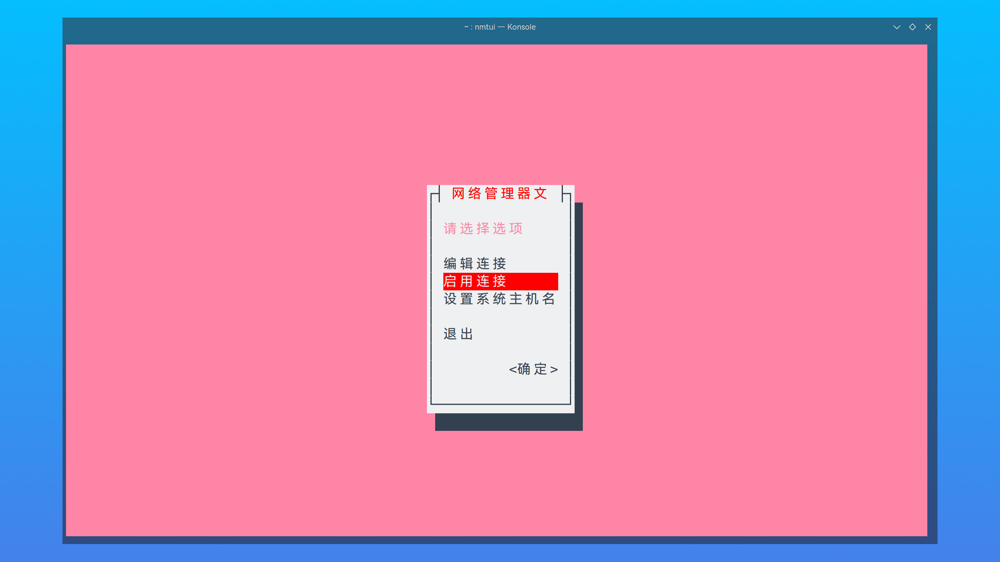

   ::: tip ℹ️ 提示

   部分截图来自其它发行版，不过不用担心！除语言和配色之外都是一样的。

   :::

3. 选择要连接的网络 > 选择 `Activate`（启用）并回车 `Enter`：

   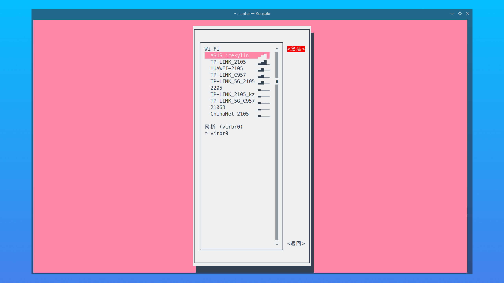

4. 若为无线连接，则需要输入 Wifi 密码 > 选择 `OK`（确定）并回车 `Enter`，稍等片刻即可连接无线网络:

   

5. 选择 `BACK`（返回）并回车 `Enter` > 选择 `QUIT`（退出）并回车 `Enter` 即可退出网络配置工具：

   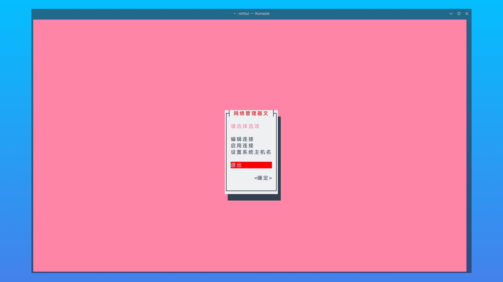

### 1-2. 固定 IP 地址

可以通过 `nmtui` 固定 IP 地址，也可以通过手动修改配置文件的方式完成。

#### 1-2-1. 通过 nmtui

1. 在终端执行 `nmtui` 运行网络配置工具：

   ```sh
   sudo nmtui # 需要 root 权限
   ```

2. 选择 `Edit a connection`（编辑连接）并回车 `Enter`：

   

3. 选择对应的连接 > 选择 `Edit...`（编辑...）：

   

4. 将 `IPv4 CONFIGURATION`（IPv4 配置）更改为 `Manual`（手动）> 在 `Addresses`（地址）中填入固定下来的 IP 地址 > 在 `Gateway`（网关）中填入网关地址（路由器的 IP 地址） > 在 `DNS servers`（DNS 服务器）中填入 `DNS 服务器`（`8.8.8.8` 为谷歌提供的公共 DNS 服务器）：

   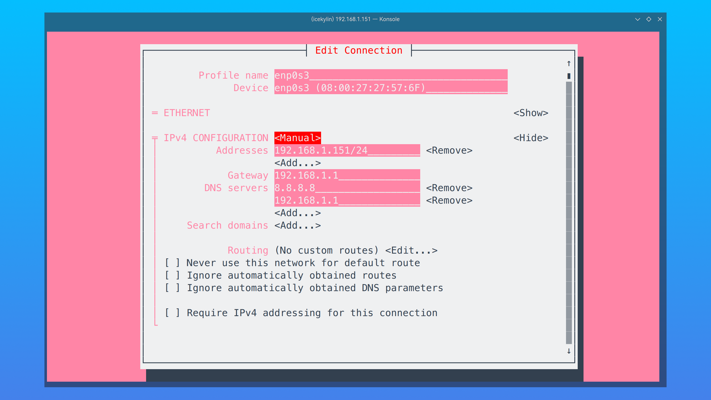

5. 选择 `OK`（确定）并回车 `Enter` 保存配置：

   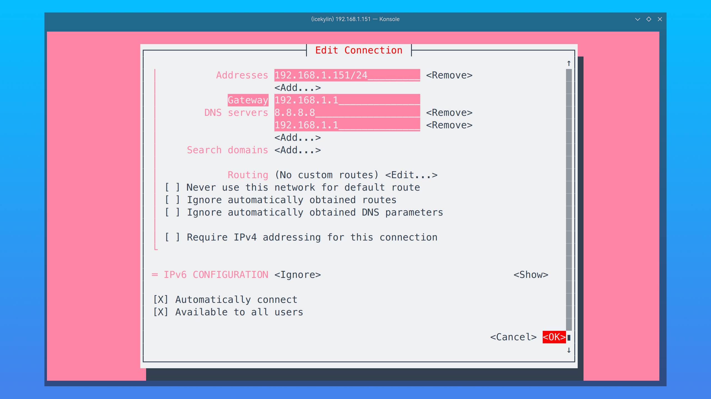

6. 选择 `BACK`（返回）并回车 `Enter` > 选择 `QUIT`（退出）并回车 `Enter` 即可退出网络配置工具

#### 1-2-2. 通过修改网络配置文件

1. 修改在 `/etc/sysconfig/network-scripts` 目录下网卡对应的配置文件：

   ```sh
   sudoedit /etc/sysconfig/network-scripts/ifcfg-enp0s3 # 替换为对应网卡名
   ```

   修改为以下内容：

   ```conf {4,10-15}
   TYPE=Ethernet
   PROXY_METHOD=none
   BROWSER_ONLY=no
   BOOTPROTO=static # 使用静态 IP 地址
   DEFROUTE=yes
   IPV4_FAILURE_FATAL=no
   NAME=enp0s3
   UUID=378885da-c689-441c-908b-239420641282
   DEVICE=enp0s3
   ONBOOT=yes # 开机启动
   IPADDR=192.168.1.151 # IP 地址（根据实际情况填写）
   NETMASK=255.255.255.0 # 子网掩码
   GATEWAY=192.168.1.1 # 网关（根据实际情况填写）
   DNS1=8.8.8.8 # DNS 服务器
   DNS2=192.168.1.1 # DNS 服务器
   ```

   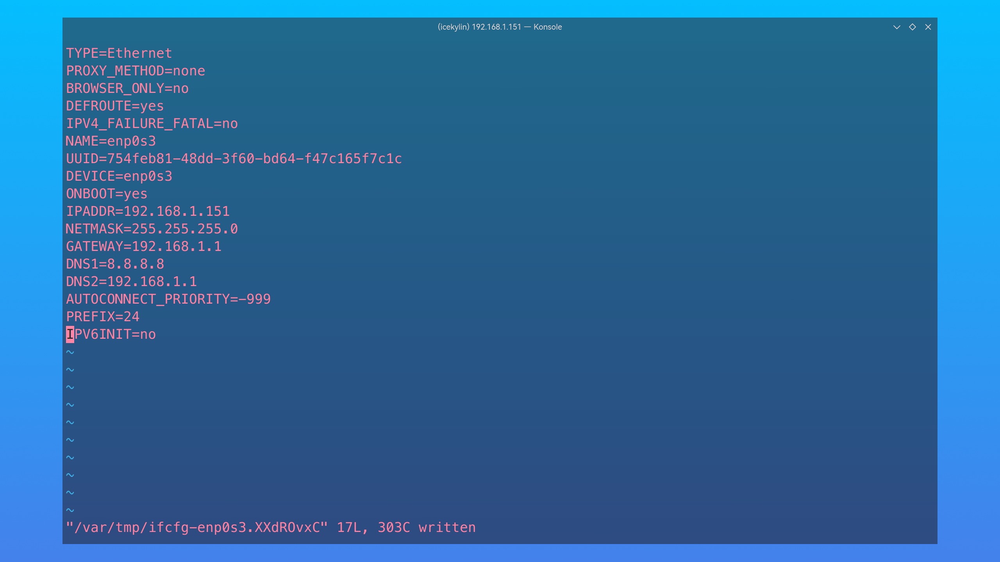

2. 重启网卡：

   ```sh
   sudo ifdown enp0s3 && sudo ifup enp0s3 # 关闭并立即启动网卡
   ```

   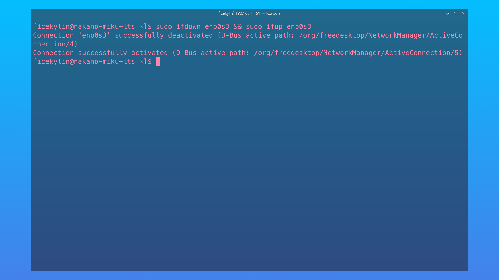

#### 1-2-3. 检查网络连通性

1. 查看 IP 地址：

   ```sh
   ip addr
   ```

   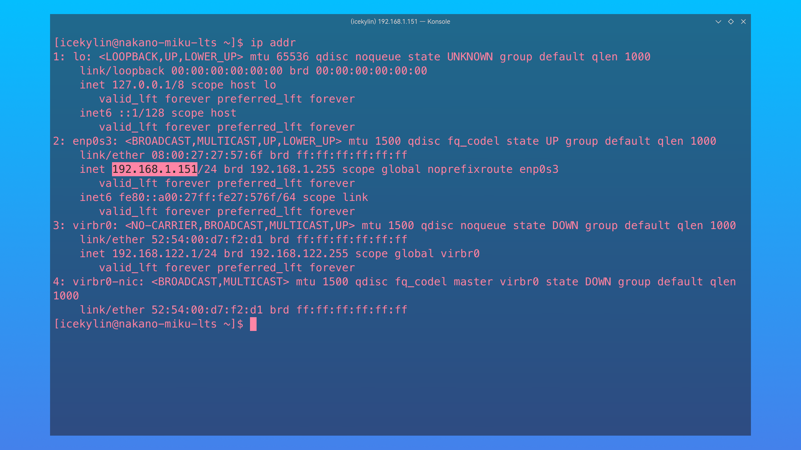

2. 通过 `ping` 命令测试网络连通性：

   ```sh
   ping www.huawei.com
   ```

   稍等片刻，若能看到数据返回，即说明已经联网：

   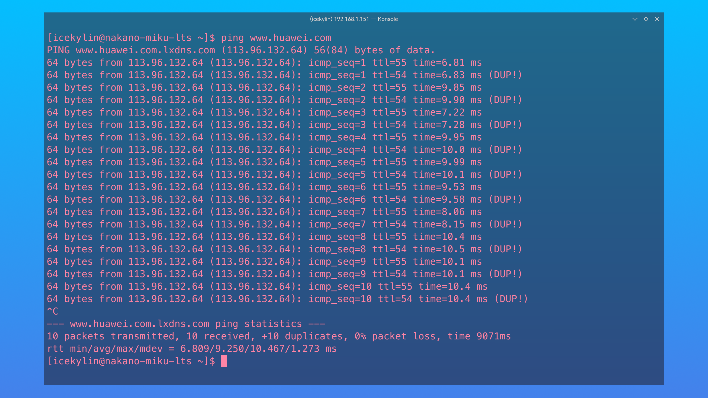

   ::: tip ℹ️ 提示

   与 Windows 不同的是，需要按下 `Ctrl` + `C` 手动退出 `ping` 命令。

   :::

### 1-3. 绑定主机名

1. 查看主机名：

   ```sh
   hostname
   ```

   

2. 编辑 `/etc/hosts` 文件，将主机名和 IP 地址对应：

   ```sh
   sudoedit /etc/hosts
   ```

   在文件末尾添加一行：

   ```conf
   192.168.1.151   hostname # 替换为对应 IP 地址和主机名
   ```

   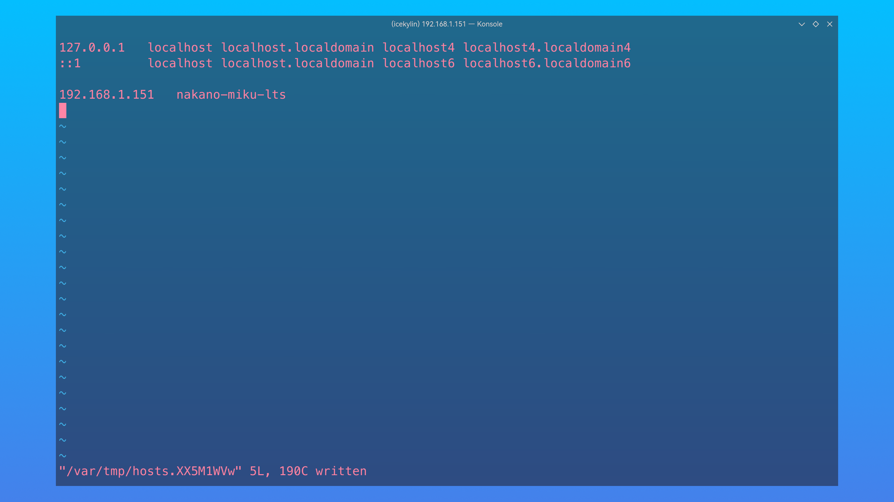

3. 测试通过主机名网络连通性：

   ```sh
   ping hostname
   ```

   

## 2. 远程控制配置

SSH（**S**ecure **Sh**ell）是一种能够以安全的方式提供远程登录的协议，也是目前远程管理 Linux 系统的首选方式。使用 SSH 来远程管理 openEuler 需要部署配置 sshd 服务程序。sshd 是基于 SSH 协议开发的一款远程管理服务程序，提供两种安全验证的方法：

- 基于口令的验证 —— 用账户和密码来验证登录
- 基于密钥的验证 —— 需要在本地生成密钥对，然后把密钥对中的公钥上传至服务器，并与服务器中的公钥进行比较

默认情况下 SSH 是开箱即用的。但为了方便我们将配置基于密钥的验证以节省输入密码这一步骤。

1. 尝试通过 SSH 登录 openEuler：

   ```sh
   ssh username@192.168.1.151 # 替换为对应账户名和 IP 地址
   ```

   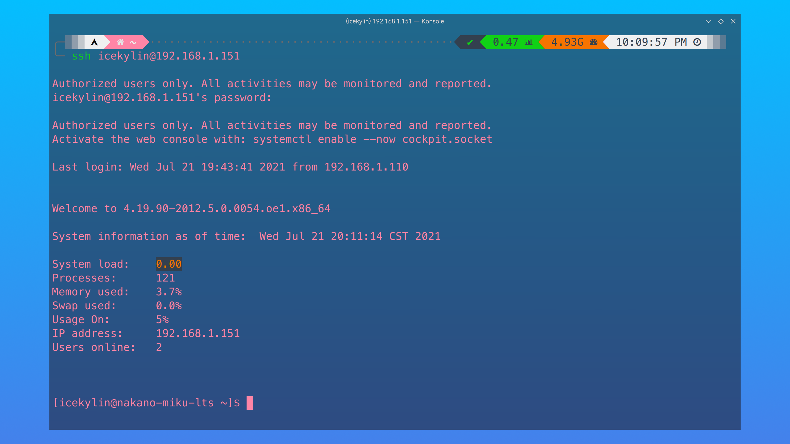

2. 可通过修改 `/etc/ssh/sshd_config` 配置 sshd 服务：

   ```sh
   sudoedit /etc/ssh/sshd_config
   ```

   由于我们在测试环境中对安全性要求不高，保持默认即可。

3. 在客户端输入执行以下命令并一路回车 `Enter` 以生成密钥对：

   ```sh
   ssh-keygen
   cat ~/.ssh/id_rsa.pub # 查看公钥文件
   ```

4. 把客户端中生成的公钥传送至 openEuler：

   ```sh
   ssh-copy-id username@192.168.1.151 # 替换为对应账户名和 IP 地址，执行后会提示输入对应用户的密码
   ```

   ::: tip ℹ️ 提示

   每添加一位账户都需要重新执行这一步，如再添加 root 用户使用基于密钥的验证：

   ```sh
   ssh-copy-id root@192.168.1.151 # 替换为对应 IP 地址，执行后会提示输入 root 用户的密码
   ```

   :::

   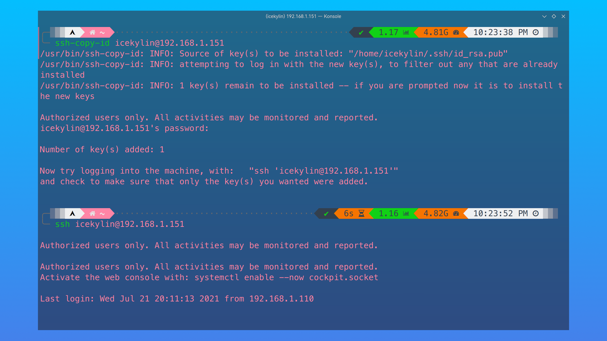

5. 重新通过 SSH 登录 openEuler，发现已经不需要密码了：

   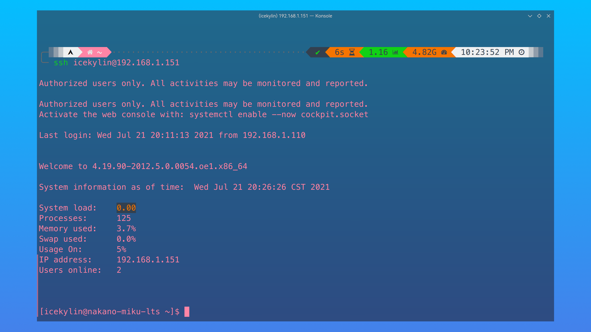

## 3. 不间断会话服务配置

当与远程主机的会话被关闭时（各种原因都有可能导致这种情况发生，如网络波动），在远程主机上运行的命令也随之被中断。显然这样是非常不方便的，尤其是在执行一些时间比较旧的任务的时候。

除了传统的 [Screen](http://www.gnu.org/software/screen/) ，还有更为现代和强大的 [tmux](https://github.com/tmux/tmux)：

tmux 是一款能够实现多窗口远程控制的开源服务程序，也叫终端复用器。简单来说就是为了解决网络异常中断或为了同时控制多个远程终端窗口而设计的程序。用户还可以使用 tmux 同时在多个远程会话中自由切换，能够做到实现如下功能：

- 会话恢复 —— 即便网络中断，也可让会话随时恢复，确保用户不会失去对远程会话的控制
- 多窗口 —— 每个会话都是独立运行的，拥有各自独立的输入输出终端窗口，终端窗口内显示过的信息也将被分开隔离保存，以便下次使用时依然能看到之前的操作记录
- 会话共享 —— 当多个用户同时登录到远程服务器时，便可以使用会话共享功能让用户之间的输入输出信息共享

1. 若按照 [openEuler 基础安装](./basic-install.md) 安装的系统，那么默认已经已经安装了 tmux，否则使用以下命令安装：

   ```sh
   sudo dnf install tmux
   ```

2. 直接执行 `tmux` 命令即可进入到 tmux 会话窗口中：

   ```sh
   tmux
   ```

   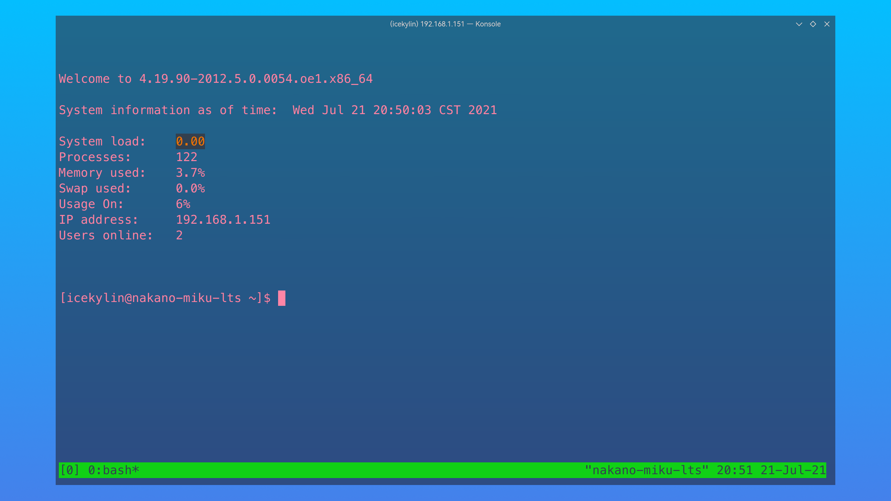

3. 执行 `exit` 命令即可退出 tmux 会话窗口

4. 更多命令以及选项意义、快捷键如下：

   命令以及选项：

   - `tmux ls` —— 查看后台有哪些会话
   - `tmux detach` —— 将会话隐藏到后台
   - `tmux split-window` —— 创建上下切割的多窗格终端
   - `tmux split-window -h` —— 创建左右切割的多窗格终端
   - `tmux select-pane -U` —— 切换至上方的窗格
   - `tmux select-pane -D` —— 切换至下方的窗格
   - `tmux select-pane -L` —— 切换至左方的窗格
   - `tmux select-pane -R` —— 切换至右方的窗格
   - `tmux swap-pane -U` —— 将当前窗格与上方的窗格互换
   - `tmux swap-pane -D` —— 将当前窗格与下方的窗格互换
   - `tmux swap-pane -L` —— 将当前窗格与左方的窗格互换
   - `tmux swap-pane -R` —— 将当前窗格与右方的窗格互换

   快捷键（按下 `Ctrl` + `B` 之后再按，不是一起按）：

   - `%` —— 划分左右两个窗格
   - `"` —— 划分上下两个窗格
   - `方向键` —— 切换到上下左右相邻的一个窗格
   - `;` —— 切换至上一个窗格
   - `o` —— 切换至下一个窗格
   - `{` —— 将当前窗格与上一个窗格位置互换
   - `}` —— 将当前窗格与下一个窗格位置互换
   - `x` —— 关闭窗格
   - `!` —— 将当前窗格拆分成独立窗口
   - `q` —— 显示窗格编号

   此外，还可通过 `Ctrl` + `B` + `方向键` 调整窗格大小（若存在多个窗格）。

## 4. 检查家目录

检查家目录下的各个常见目录是否已经创建，若没有则需通过以下命令手动创建：

```sh
cd ~
ls -hl
mkdir -p Desktop Documents Downloads Music Pictures Videos
ls -hl # 复查一下
```

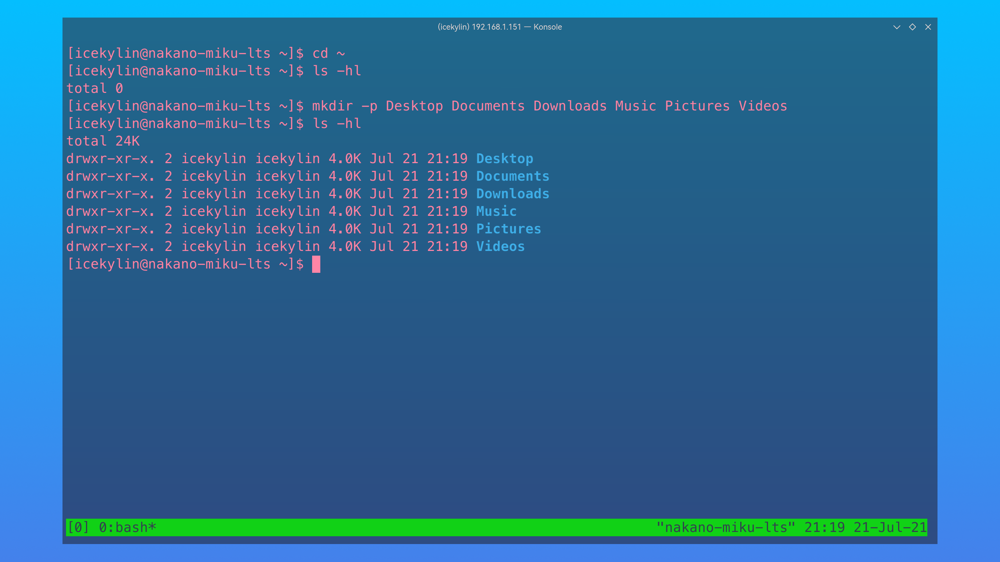
